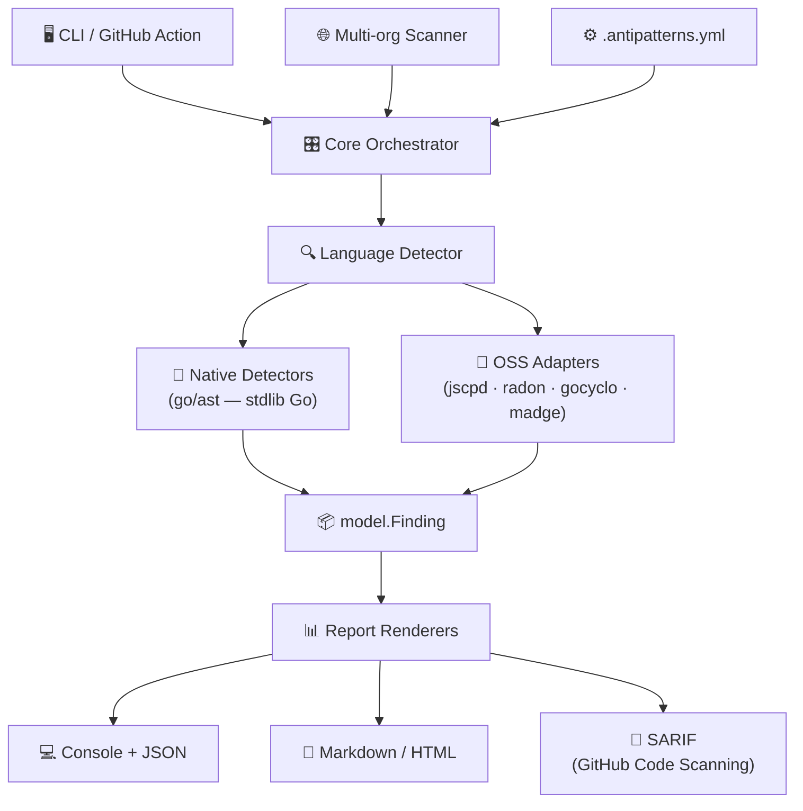

# 🔍 Klaus antipatterns-search

> Multi-language anti-pattern detector — CLI, GitHub Action and multi-org scanner powered by Go (go/ast nativo) + adaptadores OSS

[](https://github.com/Ka0s-Klaus)
[](https://go.dev)
[](LICENSE)
[](https://github.com/Ka0s-Klaus/Klaus-antipatterns-search/releases)
[](https://github.com/orgs/Ka0s-Klaus/projects/21)

---

## 🤔 ¿Qué hago? ¿Cómo lo hago? ¿Y para qué lo hago?

### ¿Qué hago?

Soy un detector de **anti-patrones de código** multi-lenguaje. Analizo repositorios — localmente, en CI/CD o a escala de organización — y genero diagnósticos accionables de deuda técnica: God Objects, complejidad excesiva, código duplicado, dependencias circulares, magic numbers y más.

### ¿Cómo lo hago?

Combino dos enfoques complementarios:

1. **Detectores nativos** sobre el AST de Go via [`go/ast`](https://pkg.go.dev/go/ast) (stdlib pura, cero CGO) — God Object, funciones gigantes y magic numbers en ficheros `.go`. Extensión tree-sitter disponible como punto de extensión futuro para otros lenguajes.
2. **Adaptadores a linters OSS** (`jscpd`, `radon`, `gocyclo`, `madge`, etc.) — orquestados por subproceso con degradación elegante si no están instalados.

Todos los hallazgos se normalizan al mismo modelo `Finding` y se renderizan en múltiples formatos.

### ¿Para qué lo hago?

Porque trabajar con muchos repositorios en organizaciones distintas (Ka0s-Klaus, mango, masorange) sin una herramienta unificada hace que la deuda técnica se acumule silenciosamente. `Klaus-antipatterns-search` da visibilidad reproducible y consistente sobre la salud del código en cualquier stack.

---

## 🏗️ Arquitectura



---

## 📦 Instalación

### GitHub Action (recomendado)

```yaml
- uses: Ka0s-Klaus/Klaus-antipatterns-search@v1.0.0
  with:
    path: .
    upload-sarif: 'true'
    comment-pr: 'true'
```

> Pinear siempre a un tag (`@v1.0.0`) — nunca usar `@main` en producción.

### Binario precompilado (linux/darwin/windows · amd64/arm64)

```bash
# Descargar la última release para linux/amd64
VERSION=$(curl -sSf https://api.github.com/repos/Ka0s-Klaus/Klaus-antipatterns-search/releases/latest \
  | jq -r '.tag_name | ltrimstr("v")')
curl -sSfL \
  "https://github.com/Ka0s-Klaus/Klaus-antipatterns-search/releases/download/v${VERSION}/antipatterns_${VERSION}_linux_amd64.tar.gz" \
  | tar -xzf - antipatterns
sudo mv antipatterns /usr/local/bin/
```

### `go install` (para desarrolladores Go)

```bash
go install github.com/Ka0s-Klaus/Klaus-antipatterns-search/cmd/antipatterns@latest
```

### Verificación

```bash
antipatterns version
antipatterns scan ./mi-repo
```

---

## 🚀 Modos de ejecución

| Modo | Comando | Descripción |
| --- | --- | --- |
| 📁 **Local** | `antipatterns scan ./ruta` | Analiza un repo local |
| 🔁 **CI/CD** | GitHub Action | Comenta en PR + sube SARIF |
| 🌐 **Multi-org** | `antipatterns scan-org <perfil>` | Escanea toda una organización |

---

## 🎯 Anti-patrones detectados (MVP)

| Anti-patrón | Método | Fuente |
| --- | --- | --- |
| 🐘 God Object / God Class | métricas de clase (LOC, métodos, fan-in/out) | nativo (go/ast) |
| 🌀 Complejidad excesiva | complejidad ciclomática / cognitiva | OSS: `radon`, `gocyclo`, `eslint` |
| 🔁 Código duplicado | detección de clones tipo-1/tipo-2 | OSS: `jscpd` |
| 🔄 Dependencias circulares | grafo de imports + detección de ciclos | OSS: `madge`, `go list` |
| 🔢 Magic numbers/strings | literales repetidos fuera de constantes | nativo |
| 📏 Funciones/ficheros gigantes | LOC y nº parámetros sobre umbral | nativo |
| 💀 Código muerto (lava flow) | símbolos sin referencias | OSS: `vulture`, `ts-prune` |
| 📋 Copy-paste programming | agregación de duplicación por directorio | derivado |

---

## 📊 Formatos de reporte

- **Terminal** — tabla coloreada por severidad (info/low/medium/high/critical)
- **JSON** — `report.json` estructurado para integración con otras herramientas
- **Markdown/HTML** — reporte navegable con métricas y enlaces a líneas afectadas
- **SARIF** — integración con GitHub Code Scanning (pestaña Security)

---

## ⚙️ Configuración

```yaml
# .antipatterns.yml
orgs:
  ka0s-klaus:
    token_env: GH_TOKEN_KA0S
    output: reports/ka0s/
    publish: true
  masorange:
    token_env: GH_TOKEN_MASORANGE
    output: reports/masorange/
    publish: false   # datos de cliente: nunca se publican

thresholds:
  god_object:
    methods: 20
    loc: 400
  function_loc: 40    # funciones de más de 40 líneas
  cyclomatic: 10      # complejidad ciclomática máxima por función
  duplication_pct: 5
```

---

## 🗺️ Roadmap

| Fase | Contenido | Estado |
| --- | --- | --- |
| **0 — Andamiaje** | módulo Go, CLI Cobra, modelo Finding, renderers console+JSON | ✅ Completado |
| **1 — MVP nativo** | go/ast + detectores: God Object, funciones gigantes, magic numbers | ✅ Completado |
| **2 — Adaptadores OSS** | `jscpd`, `madge`, `radon`, `gocyclo`, skip elegante | ✅ Completado |
| **3 — SARIF + Action** | GitHub Action, comentario en PR, Code Scanning | ✅ Completado |
| **4 — Multi-org** | `scan-org`, perfiles, paralelismo, panel agregado | ✅ Completado |
| **5 — Publicación** | README, licencia, releases cross-compilados, action.yml binary | ✅ Completado |
| **6 — Integration test** | Self-scan en CI, calibración de thresholds, codeql-action v4 | ✅ Completado |

---

## 🤝 Contribuir

Este proyecto sigue el flujo **Issue → Rama → PR** sin excepciones.

1. Abre una Issue con el contexto completo
2. Crea una rama `GH-{N}-descripcion-breve`
3. Trabaja en la rama
4. Abre PR contra `main`

---

## 📄 Licencia

MIT © [Ka0s-Klaus](https://github.com/Ka0s-Klaus)
