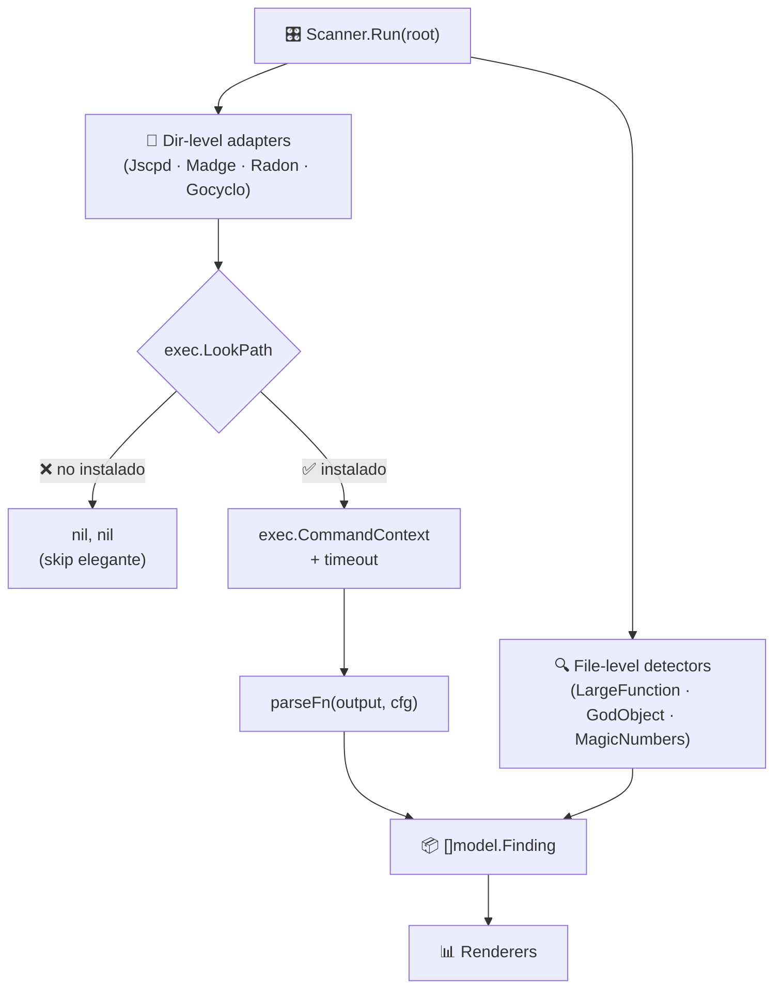

# 🔌 Fase 2 — Adaptadores OSS

## 🤔 ¿Qué hago? ¿Cómo lo hago? ¿Y para qué lo hago?

### ¿Qué hago?
Integro cuatro herramientas OSS de análisis de código como adaptadores de Klaus-antipatterns-search, normalizando sus hallazgos al modelo `Finding` universal del proyecto.

### ¿Cómo lo hago?
Cada adaptador sigue el mismo patrón:
1. 🔍 Verifica si la herramienta está en `PATH` (`exec.LookPath`)
2. ⚡ Si no está instalada → **skip elegante** (devuelve `nil, nil`)
3. 🚀 Si está instalada → ejecuta con `exec.CommandContext` + timeout
4. 📊 Parsea el output (JSON o texto) → `[]model.Finding`

Los adaptadores operan sobre el **directorio raíz completo** (a diferencia de los detectores nativos que van fichero a fichero).

### ¿Para qué lo hago?
Porque las herramientas OSS detectan anti-patrones que no son triviales de reimplementar en Go/AST: duplicación de código multi-lenguaje, dependencias circulares en JS/TS, complejidad ciclomática en Python. Integrarlas permite cobertura multi-stack sin reinventar la rueda.

---

## 🏗️ Arquitectura



---

## 📦 Adaptadores implementados

### 🔁 `jscpd` — Duplicación de código

| Campo | Detalle |
| --- | --- |
| **Herramienta** | [`jscpd`](https://github.com/kucherenko/jscpd) |
| **Anti-patrón** | Clones tipo-1/tipo-2 (duplicación exacta o normalizada) |
| **Lenguajes** | Multi-lenguaje (Go, Python, JS/TS, Java, ...) |
| **Regla emitida** | `duplication` |
| **Severidad** | Configurable via `severities.duplication` |
| **Umbral** | `thresholds.duplication_pct` (%) |

**Comando ejecutado:**
```bash
jscpd <root> --reporters json --output <tmpdir> --silent
```

**Findings emitidos:**
- 1 finding de resumen si el porcentaje supera `duplication_pct`
- 1 finding por cada par de clones detectados

---

### 🔄 `madge` — Dependencias circulares JS/TS

| Campo | Detalle |
| --- | --- |
| **Herramienta** | [`madge`](https://github.com/pahen/madge) |
| **Anti-patrón** | Dependencias circulares en grafos de imports |
| **Lenguajes** | JavaScript, TypeScript |
| **Regla emitida** | `circular_dependency` |
| **Severidad** | Configurable via `severities.circular_deps` |

**Comando ejecutado:**
```bash
madge --circular <root>
```

**Parsing:** texto `N) a -> b -> c` → un finding por ciclo.

---

### 🌀 `radon` — Complejidad ciclomática Python

| Campo | Detalle |
| --- | --- |
| **Herramienta** | [`radon`](https://radon.readthedocs.io) |
| **Anti-patrón** | Complejidad ciclomática excesiva |
| **Lenguajes** | Python |
| **Regla emitida** | `cyclomatic_complexity` |
| **Severidad** | Configurable via `severities.cyclomatic` |
| **Umbral** | `thresholds.cyclomatic` |

**Comando ejecutado:**
```bash
radon cc -j <root>
```

**Parsing:** JSON `{"file.py": [{"name": "fn", "complexity": N, "lineno": L}]}`

---

### ⚙️ `gocyclo` — Complejidad ciclomática Go

| Campo | Detalle |
| --- | --- |
| **Herramienta** | [`gocyclo`](https://github.com/fzipp/gocyclo) |
| **Anti-patrón** | Complejidad ciclomática excesiva en Go |
| **Lenguajes** | Go |
| **Regla emitida** | `cyclomatic_complexity` |
| **Severidad** | Configurable via `severities.cyclomatic` |
| **Umbral** | `thresholds.cyclomatic` |

**Comando ejecutado:**
```bash
gocyclo -over <threshold> <root>
```

**Parsing:** texto `<complexity> <pkg> <func> <file>:<line>:<col>`

> ⚠️ `gocyclo` complementa al detector nativo de `large_function`. El detector nativo mide LOC; gocyclo mide complejidad ciclomática (rutas de ejecución).

---

## ⚙️ Configuración

Todos los umbrales son configurables en `.antipatterns.yml`:

```yaml
thresholds:
  cyclomatic: 15      # umbral para radon y gocyclo
  duplication_pct: 5  # umbral de % para jscpd

severities:
  cyclomatic: medium
  duplication: medium
  circular_deps: high
```

---

## 🔧 Instalación de herramientas (opcional)

Los adaptadores hacen **skip elegante** si la herramienta no está instalada. Para activarlos:

```bash
# jscpd (Node.js requerido)
npm install -g jscpd

# madge (Node.js requerido)
npm install -g madge

# radon (Python requerido)
pip install radon

# gocyclo (Go requerido)
go install github.com/fzipp/gocyclo/cmd/gocyclo@latest
```

---

## 🧪 Cobertura de tests

| Adaptador | Tests | Estrategia |
| --- | --- | --- |
| `jscpd` | 5 | `parseJscpdOutput` con fixtures JSON + test de skip |
| `madge` | 4 | `parseMadgeOutput` con fixtures texto + test de skip |
| `radon` | 6 | `parseRadonOutput` con fixtures JSON + test de skip |
| `gocyclo` | 6 | `parseGocycloOutput` con fixtures texto + test de skip |

Los tests de parsing cubren: output vacío, por debajo del umbral, por encima del umbral, input malformado y skip cuando la herramienta no está instalada.

---

## 🔗 Documentos relacionados

- [Detectores nativos (Fase 1)](fase-1-detectores-nativos.md) — LargeFunction, GodObject, MagicNumbers
- [README principal](../README.md) — roadmap completo del proyecto
