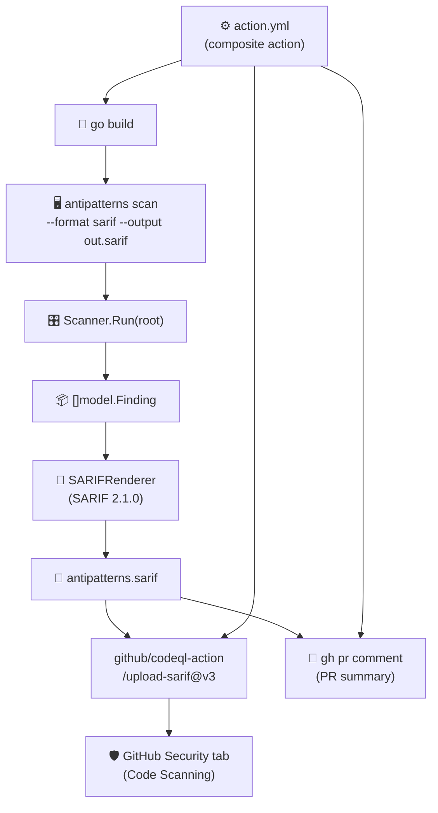
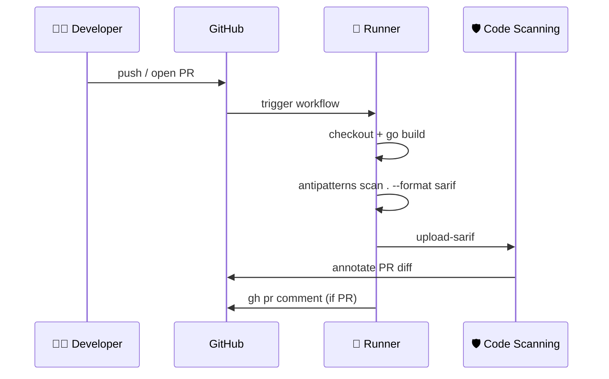

# 🔐 Fase 3 — SARIF Output + GitHub Action

## 🤔 ¿Qué hago? ¿Cómo lo hago? ¿Y para qué lo hago?

### ¿Qué hago?
Añado salida en formato **SARIF 2.1.0** a Klaus-antipatterns-search y lo empaqueto como **GitHub Action composite**, habilitando integración nativa con **GitHub Code Scanning** (pestaña Security) y comentarios automáticos en PRs.

### ¿Cómo lo hago?
1. 🔐 **Renderer SARIF** (`internal/renderer/sarif.go`) — transforma `[]model.Finding` al formato SARIF 2.1.0 estándar, con catálogo de reglas y nivel de severidad conforme a la spec.
2. 🖥️ **CLI** — `--format sarif` + `--output <file>` permiten generar el fichero SARIF directamente desde la línea de comandos.
3. ⚙️ **GitHub Action** (`action.yml`) — action composite que construye el binario desde fuente, ejecuta el scan, sube el SARIF a Code Scanning y comenta en el PR.
4. 🔁 **Self-scan workflow** (`.github/workflows/antipatterns.yml`) — el propio repositorio se analiza con la herramienta en cada push y PR.

### ¿Para qué lo hago?
Porque SARIF es el formato estándar de intercambio de vulnerabilidades y calidad de código de GitHub. Al generar SARIF, los hallazgos aparecen en la pestaña **Security > Code Scanning** con anotaciones inline en el diff, sin necesidad de ninguna integración adicional. La GitHub Action permite que cualquier repositorio adopte Klaus-antipatterns-search con tres líneas de YAML.

---

## 🏗️ Arquitectura



---

## 🔐 Renderer SARIF 2.1.0

### Mapping Finding → SARIF result

| Campo `Finding` | Campo SARIF | Notas |
| --- | --- | --- |
| `Rule` | `result.ruleId` | ID de la regla |
| `Severity` | `result.level` | ver tabla de mapeo |
| `Message` | `result.message.text` | texto libre |
| `Location.File` | `physicalLocation.artifactLocation.uri` | ruta relativa al root |
| `Location.Line` | `physicalLocation.region.startLine` | omitido si 0 |
| `Location.Column` | `physicalLocation.region.startColumn` | omitido si 0 |

### Mapeo de severidad → SARIF level

| Severidad Klaus | SARIF level |
| --- | --- |
| `critical` | `error` |
| `high` | `error` |
| `medium` | `warning` |
| `low` | `note` |
| `info` | `note` |

### Catálogo de reglas (`driver.rules[]`)

| ID | Nombre | Tags |
| --- | --- | --- |
| `large_function` | LargeFunction | maintainability |
| `god_object` | GodObject | maintainability, solid |
| `magic_number` | MagicNumber | maintainability, readability |
| `duplication` | Duplication | maintainability, duplication |
| `circular_dependency` | CircularDependency | architecture, coupling |
| `cyclomatic_complexity` | CyclomaticComplexity | maintainability, complexity |

---

## 🖥️ Uso desde CLI

```bash
# Formato SARIF a stdout
antipatterns scan ./repo --format sarif

# SARIF a fichero
antipatterns scan ./repo --format sarif --output antipatterns.sarif

# JSON (antes --json, ahora --format json)
antipatterns scan ./repo --format json

# Console (defecto)
antipatterns scan ./repo --format console
```

### Flags del comando `scan`

| Flag | Tipo | Default | Descripción |
| --- | --- | --- | --- |
| `--format` | string | `console` | Formato de salida: `console`, `json`, `sarif` |
| `--output`, `-o` | string | `""` (stdout) | Fichero de destino |

> ⚠️ `--json` ha sido reemplazado por `--format json`. No hay versión pública anterior, no hay breaking change.

---

## ⚙️ GitHub Action

### Uso básico

```yaml
name: Anti-pattern scan
on: [push, pull_request]

permissions:
  security-events: write
  pull-requests: write

jobs:
  scan:
    runs-on: ubuntu-latest
    steps:
      - uses: actions/checkout@v4
      - uses: Ka0s-Klaus/Klaus-antipatterns-search@main
```

### Inputs

| Input | Default | Descripción |
| --- | --- | --- |
| `path` | `.` | Directorio a analizar |
| `upload-sarif` | `true` | Subir SARIF a Code Scanning |
| `sarif-output` | `antipatterns.sarif` | Ruta del fichero SARIF |
| `comment-pr` | `true` | Comentar resumen en PR |
| `go-version` | `1.22` | Versión de Go para compilar |

### Outputs

| Output | Descripción |
| --- | --- |
| `findings-count` | Número total de findings detectados |

### Ejemplo avanzado

```yaml
- uses: Ka0s-Klaus/Klaus-antipatterns-search@main
  with:
    path: src/
    upload-sarif: true
    sarif-output: results/antipatterns.sarif
    comment-pr: true
```

### Permisos requeridos

```yaml
permissions:
  contents: read
  security-events: write    # para upload-sarif
  pull-requests: write      # para comment-pr
```

---

## 🔄 Self-scan workflow

El repositorio se analiza a sí mismo en cada push y PR via `.github/workflows/antipatterns.yml`:



---

## 🧪 Cobertura de tests

| Test | Qué verifica |
| --- | --- |
| `TestSARIFRendererEmpty` | 0 findings → SARIF válido con results vacío |
| `TestSARIFRendererSingleFinding` | 1 finding → ruleId, level, message, URI relativa |
| `TestSARIFRendererSeverityMapping` | 5 severidades → levels SARIF correctos |
| `TestSARIFRendererRelativePaths` | Path absoluto → URI relativa + %SRCROOT% + region |
| `TestSARIFRendererValidSchema` | Schema URL, version 2.1.0, tool name presentes |
| `TestSARIFRendererRulesPresent` | 6 reglas en catálogo del driver |

---

## 🔗 Documentos relacionados

- [Detectores nativos (Fase 1)](fase-1-detectores-nativos.md) — LargeFunction, GodObject, MagicNumbers
- [Adaptadores OSS (Fase 2)](fase-2-adaptadores-oss.md) — jscpd, madge, radon, gocyclo
- [README principal](../README.md) — roadmap completo del proyecto
