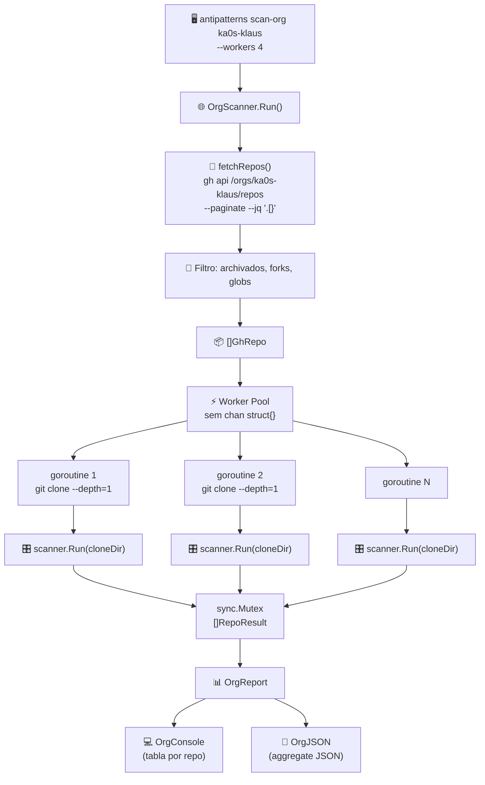
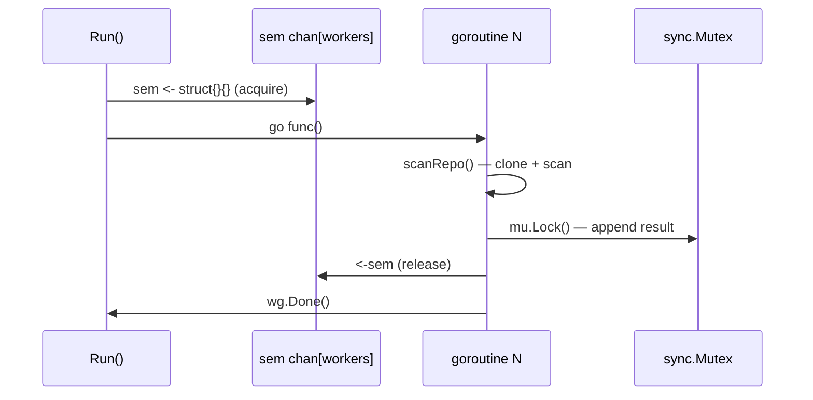
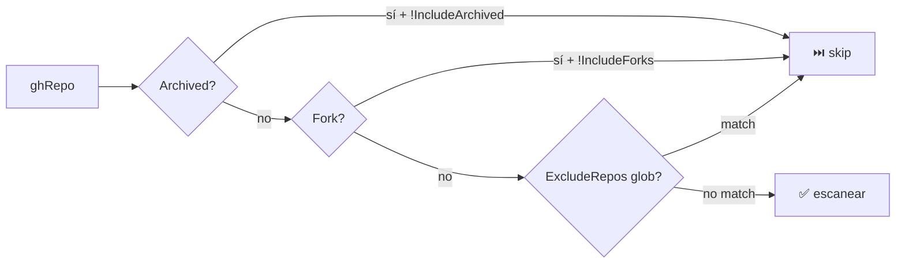

# 🌐 Fase 4 — Multi-org Scanner

## 🤔 ¿Qué hago? ¿Cómo lo hago? ¿Y para qué lo hago?

### ¿Qué hago?
Extiendo Klaus-antipatterns-search con capacidad de escanear **todas las organizaciones y repositorios** de GitHub en un único comando, con ejecución paralela y un panel agregado de resultados.

### ¿Cómo lo hago?
1. 🌐 **`scan-org <perfil>`** — nuevo subcomando que lee el perfil de org desde `.antipatterns.yml`, enumera repos via GitHub API y los escanea en paralelo.
2. ⚡ **Worker pool** — semáforo de goroutines (`--workers N`, default 4) protege contra saturación de red y CPU.
3. 📊 **Panel agregado** — renderers `OrgConsole` y `OrgJSON` presentan resultados por repo con rollup de totales.
4. 🧹 **Clone + cleanup** — cada repo se clona shallow (`--depth=1`) en `os.MkdirTemp` y se limpia al terminar.

### ¿Para qué lo hago?
Porque gestionar >5 repositorios de múltiples orgs (Ka0s-Klaus, Mango, MasOrange) manualmente es inviable. `scan-org` da visibilidad de deuda técnica a escala de organización en un solo comando, directamente desde CI/CD o desde local.

---

## 🏗️ Arquitectura



---

## ⚙️ Configuración — `.antipatterns.yml`

```yaml
orgs:
  ka0s-klaus:
    token_env: GH_TOKEN_KA0S       # var de entorno con el token; vacío = gh auth
    output: reports/ka0s/
    publish: true
    exclude_repos:                  # globs de filepath.Match
      - "mirror-*"
      - "archived-*"
    include_forks: false            # excluir forks (default)
    include_archived: false         # excluir repos archivados (default)

  masorange:
    token_env: GH_TOKEN_MASORANGE
    output: reports/masorange/
    publish: false                  # datos de cliente: nunca se publican
    exclude_repos: []
```

### Campos de `OrgConfig`

| Campo | Tipo | Default | Descripción |
| --- | --- | --- | --- |
| `token_env` | string | `""` | Nombre de la var de entorno con el GH token |
| `output` | string | `""` | Directorio destino para reportes |
| `publish` | bool | `false` | Si los reportes son publicables |
| `exclude_repos` | []string | `[]` | Globs de repos a excluir (usa `filepath.Match`) |
| `include_forks` | bool | `false` | Incluir repos fork |
| `include_archived` | bool | `false` | Incluir repos archivados |

---

## 🖥️ Uso desde CLI

```bash
# Scan básico (formato console)
antipatterns scan-org ka0s-klaus

# Con más workers y salida JSON
antipatterns scan-org ka0s-klaus --workers 8 --format json --output reports/ka0s.json

# Cliente con token específico (el token vive en la var de entorno configurada en token_env)
GH_TOKEN_MASORANGE=ghp_xxx antipatterns scan-org masorange
```

### Flags de `scan-org`

| Flag | Default | Descripción |
| --- | --- | --- |
| `--format` | `console` | Formato de salida: `console`, `json` |
| `--output`, `-o` | `""` (stdout) | Fichero de destino |
| `--workers` | `4` | Goroutines paralelas de scan |

---

## 📊 Ejemplo de salida — console

```
🌐 Org scan: ka0s-klaus (20 repos)
────────────────────────────────────────────────────────────────────────
 REPO                                FINDINGS  TOP RULE
────────────────────────────────────────────────────────────────────────
 Klaus-antipatterns-search                  8  magic_number            ⚠️
 ka0s                                      19  magic_number            ⚠️
 klaude-code-local                          0  —                       ✅
 ka0s.github.io                             0  —                       ✅
────────────────────────────────────────────────────────────────────────
 TOTAL                                     27  magic_number
────────────────────────────────────────────────────────────────────────
```

---

## 🏗️ Diseño interno

### `OrgScanner` — inyección de dependencias

El `OrgScanner` tiene dos funciones configurables para facilitar los tests:

```go
type OrgScanner struct {
    workers int
    fetchFn FetcherFn  // func(orgName string, profile OrgConfig) ([]GhRepo, error)
    scanFn  ScannerFn  // func(repo GhRepo, cfg *config.Config) model.RepoResult
}
```

`New(workers)` inyecta las implementaciones reales. Los tests usan `.WithFetcher()` y `.WithScanner()` para inyectar stubs sin tocar la red ni el disco.

### Worker pool con semáforo



### Filtrado de repos



---

## 🧪 Cobertura de tests

| Test | Qué verifica |
| --- | --- |
| `TestScanOrgParallel` | 20 repos concurrentes sin data races (`-race`) |
| `TestScanOrgEmpty` | Org vacía → report vacío, sin llamar al scanner |
| `TestRepoFilter` | 7 casos de IsExcluded con globs y patrones múltiples |
| `TestAggregateReport` | TotalFindings() + TopRule() con repos mixtos |
| `TestScanOrgWorkersCapped` | Más workers que repos no produce deadlock |

---

## 🔒 Seguridad

- Los tokens **nunca se hardcodean** — siempre via `token_env` → variable de entorno.
- Los reportes de clientes tienen `publish: false` — nunca se comprometen a git.
- Los repos clonados se limpian con `defer os.RemoveAll(tmpDir)` incluso ante panic.
- `gh api` usa la autenticación activa de `gh auth` si `token_env` está vacío.

---

## 🔗 Documentos relacionados

- [SARIF + GitHub Action (Fase 3)](fase-3-sarif-action.md) — formato de salida por repo
- [Adaptadores OSS (Fase 2)](fase-2-adaptadores-oss.md) — detección usada por cada scanRepo
- [Detectores nativos (Fase 1)](fase-1-detectores-nativos.md) — detectores Go usados en cada repo
- [README principal](../README.md) — roadmap completo del proyecto
