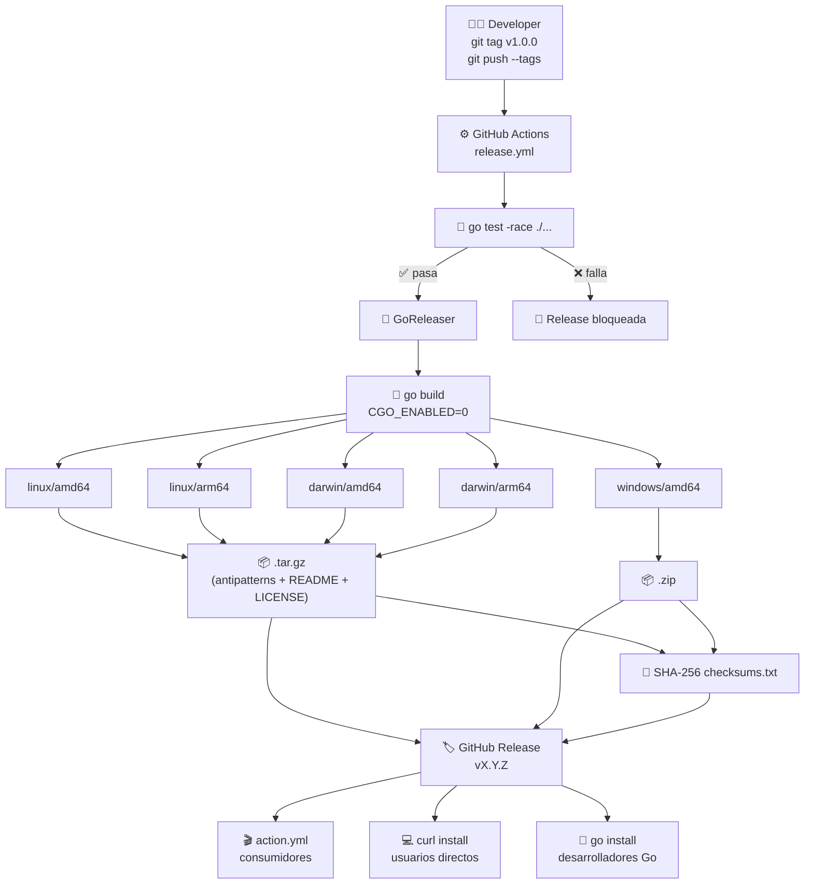
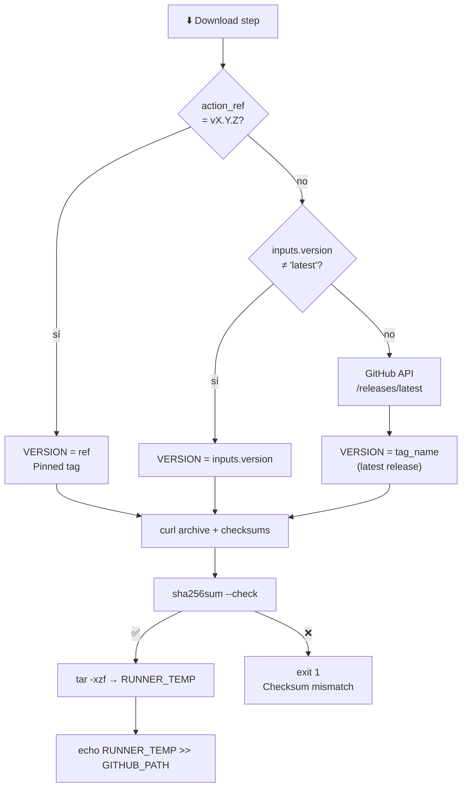

# 📦 Fase 5 — Publicación

## 🤔 ¿Qué hago? ¿Cómo lo hago? ¿Y para qué lo hago?

### ¿Qué hago?
Publico Klaus-antipatterns-search como **herramienta de distribución open-source**: binarios pre-compilados para todas las plataformas disponibles en GitHub Releases, `action.yml` actualizado para descargar el binario en vez de compilar desde fuente, y documentación de instalación lista para usuarios externos.

### ¿Cómo lo hago?
1. 🏗️ **GoReleaser** — `.goreleaser.yml` cross-compila para linux/darwin/windows × amd64/arm64, genera archives tar.gz/zip y publica en GitHub Releases con checksums SHA-256.
2. 🔁 **Release workflow** — `.github/workflows/release.yml` se dispara con cualquier tag `v*`, ejecuta tests antes de publicar y llama a GoReleaser.
3. ⬇️ **action.yml renovado** — el paso de build (`setup-go` + `go build`) se sustituye por un paso de descarga que: detecta OS/arch, resuelve la versión correcta, descarga el archive, verifica el checksum y extrae el binario al PATH.
4. 📚 **README** — nueva sección "Instalación" con instrucciones para GitHub Action, binario curl y `go install`.

### ¿Para qué lo hago?
- **Velocidad en CI**: descargar un binario de ~5 MB tarda ~2 segundos; compilar desde fuente con `go build` puede tardar 30-60 segundos incluyendo `setup-go` y descarga de módulos.
- **Reproducibilidad**: la acción pinada a `@v1.0.0` ejecuta exactamente ese binario, no lo que estuviera en `main` cuando alguien hizo push.
- **Adopción externa**: cualquier organización puede usar la herramienta sin tener Go instalado.

---

## 🏗️ Arquitectura de publicación



---

## 🔁 Release workflow — `.github/workflows/release.yml`

| Paso | Descripción |
| --- | --- |
| `actions/checkout@v4` | Clone completo (`fetch-depth: 0`) para changelog automático |
| `actions/setup-go@v5` | Go 1.22 con caché activado |
| `go test -race ./...` | Gate de calidad: si fallan tests, no hay release |
| `goreleaser/goreleaser-action@v6` | Compila, empaqueta y publica en GitHub Releases |

```yaml
on:
  push:
    tags:
      - 'v[0-9]*'    # Solo tags de versión

permissions:
  contents: write    # Necesario para crear GitHub Release
```

> 🚨 **Nunca** hacer push de un tag sin haber mergeado el código a `main`. El tag debe apuntar a un commit en `main` revisado y aprobado.

---

## ⚙️ GoReleaser — `.goreleaser.yml`

### Targets de compilación

| OS | Arch | Archivo |
| --- | --- | --- |
| linux | amd64 | `antipatterns_X.Y.Z_linux_amd64.tar.gz` |
| linux | arm64 | `antipatterns_X.Y.Z_linux_arm64.tar.gz` |
| darwin | amd64 | `antipatterns_X.Y.Z_darwin_amd64.tar.gz` |
| darwin | arm64 | `antipatterns_X.Y.Z_darwin_arm64.tar.gz` |
| windows | amd64 | `antipatterns_X.Y.Z_windows_amd64.zip` |

> `CGO_ENABLED=0` — compilación puramente estática, sin dependencias del sistema en runtime.

### Artefactos publicados por release

```
antipatterns_1.0.0_linux_amd64.tar.gz
antipatterns_1.0.0_linux_arm64.tar.gz
antipatterns_1.0.0_darwin_amd64.tar.gz
antipatterns_1.0.0_darwin_arm64.tar.gz
antipatterns_1.0.0_windows_amd64.zip
antipatterns_1.0.0_checksums.txt          ← SHA-256 de todos los anteriores
```

### Inyección de versión

```
-X main.version={{.Version}}
```

Disponible en runtime vía `antipatterns version`.

---

## ⬇️ `action.yml` — Estrategia de descarga

### Lógica de resolución de versión



### Cambios respecto a Fase 3

| Fase 3 | Fase 5 |
| --- | --- |
| `setup-go@v5` (descarga Go ~300 MB) | ❌ eliminado |
| `go build ./cmd/antipatterns` (~30-60s) | ❌ eliminado |
| Sin verificación de integridad | ✅ checksum SHA-256 |
| Input `go-version` | → Input `version` |

### Compatibilidad

```yaml
# Forma recomendada — pinned tag, descarga esa versión exacta:
- uses: Ka0s-Klaus/Klaus-antipatterns-search@v1.0.0

# Con version explícita (override):
- uses: Ka0s-Klaus/Klaus-antipatterns-search@main
  with:
    version: '1.0.0'

# Siempre la última release (no recomendado en producción):
- uses: Ka0s-Klaus/Klaus-antipatterns-search@main
  with:
    version: 'latest'
```

---

## 📚 Instalación para usuarios

### GitHub Action (CI/CD)

```yaml
jobs:
  quality:
    runs-on: ubuntu-latest
    permissions:
      contents: read
      security-events: write
      pull-requests: write
    steps:
      - uses: actions/checkout@v4
      - uses: Ka0s-Klaus/Klaus-antipatterns-search@v1.0.0
        with:
          path: .
          upload-sarif: 'true'
          comment-pr: 'true'
```

### Binario directo (curl)

```bash
# linux/amd64
VERSION=$(curl -sSf https://api.github.com/repos/Ka0s-Klaus/Klaus-antipatterns-search/releases/latest \
  | jq -r '.tag_name | ltrimstr("v")')
curl -sSfL \
  "https://github.com/Ka0s-Klaus/Klaus-antipatterns-search/releases/download/v${VERSION}/antipatterns_${VERSION}_linux_amd64.tar.gz" \
  | tar -xzf - antipatterns
sudo mv antipatterns /usr/local/bin/

# Verificar
antipatterns version
```

### `go install`

```bash
go install github.com/Ka0s-Klaus/Klaus-antipatterns-search/cmd/antipatterns@latest
```

---

## 🏷️ Convención de versiones

Este proyecto sigue [Semantic Versioning 2.0.0](https://semver.org):

| Tipo | Cuándo | Ejemplo |
| --- | --- | --- |
| **Patch** (Z) | Bug fixes, mejoras menores de detectores | `v1.0.1` |
| **Minor** (Y) | Nuevos detectores, nuevas features sin breaking change | `v1.1.0` |
| **Major** (X) | Cambios en la API del CLI, modelo Finding, action inputs | `v2.0.0` |

### Proceso de release

```bash
# 1. Asegurarse de estar en main con todo mergeado
git checkout main && git pull

# 2. Crear y subir el tag
git tag v1.0.0 -m "Release v1.0.0 — publicación inicial"
git push origin v1.0.0

# 3. El workflow release.yml se dispara automáticamente
# 4. Verificar en: https://github.com/Ka0s-Klaus/Klaus-antipatterns-search/releases
```

---

## 🔒 Seguridad

- **No hay token hardcodeado** en ningún artefacto — `GITHUB_TOKEN` lo inyecta GitHub Actions automáticamente.
- **Checksum SHA-256** verificado en `action.yml` antes de ejecutar el binario descargado.
- **CGO_ENABLED=0** — binarios sin dependencias nativas, sin vectores de ataque de dynamic linking.
- **Tests obligatorios antes del release** — si algún test falla, el pipeline se detiene antes de publicar.
- **`prerelease: auto`** en goreleaser — tags con `-alpha`, `-beta`, `-rc` se marcan como pre-release automáticamente.

---

## 🔗 Documentos relacionados

- [Multi-org Scanner (Fase 4)](fase-4-multi-org.md) — `scan-org` que consume el binario publicado
- [SARIF + GitHub Action (Fase 3)](fase-3-sarif-action.md) — versión anterior de `action.yml` (referencia)
- [README principal](../README.md) — instrucciones de instalación para usuarios finales
