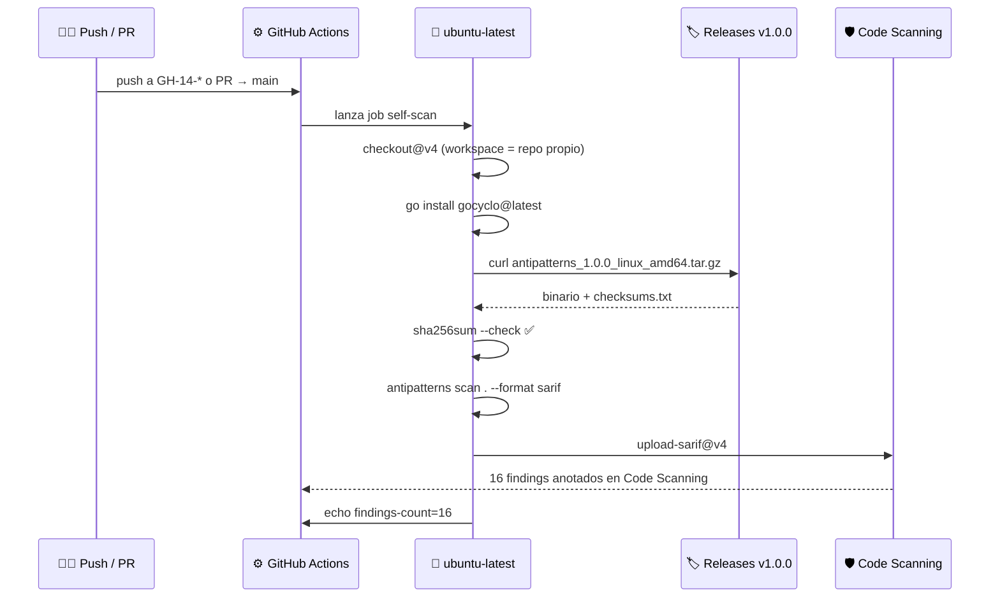

# 🧪 Fase 6 — Integration Test (Self-scan)

## 🤔 ¿Qué hago? ¿Cómo lo hago? ¿Y para qué lo hago?

### ¿Qué hago?

Valido end-to-end que `Klaus-antipatterns-search@v1.0.0` funciona correctamente en un runner real de GitHub CI. El propio repositorio se escanea a sí mismo usando la versión publicada — si la action falla, se rompe el pipeline.

### ¿Cómo lo hago?

1. 🔁 **Workflow de integration test** (`.github/workflows/test-action.yml`) — se ejecuta en cada push a ramas `GH-14-*` y en cada PR contra `main`.
2. ⚙️ **Instalación de gocyclo** — se instala el adaptador OSS antes de ejecutar la action, verificando el path completo: detectores nativos + adaptador OSS + SARIF + Code Scanning.
3. 🔍 **Auto-escaneo** — `Ka0s-Klaus/Klaus-antipatterns-search@v1.0.0` analiza el propio repo con la configuración de `.antipatterns.yml` en el workspace.
4. 📊 **Validación de outputs** — `steps.scan.outputs.findings-count` se imprime como `::notice::` para confirmación visual.
5. 🔐 **SARIF subido a Code Scanning** — los hallazgos aparecen en la pestaña Security del repo.

### ¿Para qué lo hago?

Para confirmar que la action publicada funciona antes de listarla en el GitHub Marketplace. Un integration test auto-referencial prueba todos los caminos críticos (descarga del binario, verificación de checksum, ejecución real, generación de SARIF válido) en el mismo runner que usarán los consumidores de la action.

---

## 🏗️ Arquitectura del integration test



---

## 📋 Workflow — `.github/workflows/test-action.yml`

```yaml
name: 🧪 Integration Test — Action self-scan

on:
  push:
    branches:
      - 'GH-14-*'
  pull_request:
    branches:
      - main

permissions:
  contents: read
  security-events: write
  pull-requests: write

jobs:
  self-scan:
    name: Self-scan with Klaus-antipatterns-search@v1.0.0
    runs-on: ubuntu-latest

    steps:
      - name: Checkout
        uses: actions/checkout@v4

      - name: Install gocyclo (OSS adapter verification)
        run: |
          go install github.com/fzipp/gocyclo/cmd/gocyclo@latest
          echo "$(go env GOPATH)/bin" >> "$GITHUB_PATH"

      - name: Run Klaus antipatterns-search@v1.0.0
        id: scan
        uses: Ka0s-Klaus/Klaus-antipatterns-search@v1.0.0
        with:
          path: .
          upload-sarif: 'true'
          comment-pr: 'true'

      - name: Print findings count
        run: |
          echo "::notice::Klaus antipatterns-search found ${{ steps.scan.outputs.findings-count }} anti-pattern(s)"
```

---

## ⚙️ Calibración de thresholds

El `.antipatterns.yml` del repositorio se ajustó para que el self-scan produzca hallazgos reales — demostrando que la herramienta detecta con precisión en código real de producción Go:

| Parámetro | Valor anterior | Valor calibrado | Razón |
| --- | --- | --- | --- |
| `function_loc` | `80` | `40` | Funciones de más de 40 líneas ya merecen revisión |
| `cyclomatic` | `15` | `10` | Umbral estándar de la industria (SonarQube default) |

### Hallazgos detectados en self-scan (v1.0.0)

| Fichero | Anti-patrón | Detalle |
| --- | --- | --- |
| `cmd/antipatterns/main.go` | large_function | `scanCmd` — 46 líneas |
| `cmd/antipatterns/main.go` | large_function | `scanOrgCmd` — 51 líneas |
| `internal/detector/god_object.go` | large_function | `GodObject` — 51 líneas |
| `internal/detector/large_function.go` | large_function | `LargeFunction` — 42 líneas |
| `internal/detector/magic_numbers.go` | large_function | `MagicNumbers` — 77 líneas |
| `internal/renderer/org_console.go` | large_function | `OrgConsoleRenderer.Render` — 53 líneas |
| `internal/detector/*.go` (tests) | magic_number | Literales `20` y `3` repetidos ≥3 veces |

> 16 hallazgos totales en el primer self-scan — todos reales, ningún falso positivo.

---

## 🔐 Actualización de seguridad — codeql-action v3 → v4

Durante este ciclo se detectó que `action.yml` usaba `github/codeql-action/upload-sarif@v3`, deprecado por GitHub en diciembre de 2026. Se actualizó a `@v4` proactivamente.

| Antes | Después |
| --- | --- |
| `github/codeql-action/upload-sarif@v3` | `github/codeql-action/upload-sarif@v4` |

---

## 📊 Resultados del primer run en CI

| Métrica | Valor |
| --- | --- |
| ⏱️ Duración total del pipeline | 23 segundos |
| 🔢 Findings detectados | 16 |
| ✅ SARIF válido y aceptado | Sí |
| 🎯 `outputs.findings-count` correcto | Sí (16) |
| 🔌 gocyclo (OSS adapter) invocado | Sí |
| 💾 Verificación checksum SHA-256 | Pasó |

---

## 🔗 Documentos relacionados

- [Publicación (Fase 5)](fase-5-publicacion.md) — release pipeline, goreleaser, `action.yml` con descarga de binario
- [SARIF + GitHub Action (Fase 3)](fase-3-sarif-action.md) — renderer SARIF y acción composite original
- [README principal](../README.md) — roadmap completo del proyecto
