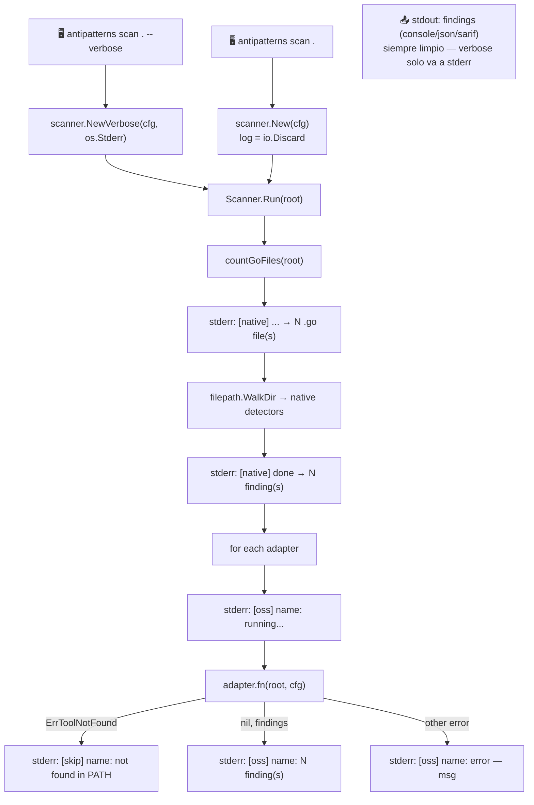

# 🔊 Fase 7 — Verbose Flag + Adaptadores OSS en Local

## 🤔 ¿Qué hago? ¿Cómo lo hago? ¿Y para qué lo hago?

### ¿Qué hago?

Añado el flag `--verbose` (`-v`) al comando `scan` para dar visibilidad completa de qué detectores corren, cuántos ficheros procesan y qué adaptadores OSS están disponibles o se saltan. Además instalo todos los adaptadores OSS en el entorno local de desarrollo para que el scanner opere al 100%.

### ¿Cómo lo hago?

1. 🏷️ **Sentinel `ErrToolNotFound`** — nuevo tipo de error en `internal/adapter/errors.go` que permite al scanner distinguir "herramienta ausente" de "error de ejecución" o "0 findings".
2. 🔌 **Actualización de adaptadores** — los cuatro adaptadores devuelven `nil, ErrToolNotFound` en lugar de `nil, nil` cuando `exec.LookPath` falla.
3. 🔊 **Flag `--verbose` / `-v`** — añadido al comando `scan`. Cuando activo, instancia `scanner.NewVerbose(cfg, os.Stderr)` en lugar de `scanner.New(cfg)`.
4. 🧠 **`scanner.NewVerbose`** — nuevo constructor que acepta un `io.Writer`. Cuando `log != io.Discard`, el scanner emite líneas de progreso a stderr durante el run.
5. 📦 **Instalación local** — `gocyclo` (Go), `radon` (pip), `jscpd`+`madge` (npm via nvm).

### ¿Para qué lo hago?

Sin verbose, el scanner producía "✅ No anti-patterns found" sin revelar que había saltado todos los adaptadores OSS por no estar instalados. El usuario no podía saber si el repo estaba limpio o si la herramienta no había analizado nada. Con `--verbose`, la visibilidad es completa:

```text
[native] large_function, god_object, magic_numbers → 34 .go file(s)
[native] done → 15 finding(s)
[oss]    jscpd: running...
[oss]    jscpd: 10 finding(s)
[oss]    gocyclo: running...
[oss]    gocyclo: 3 finding(s)
[skip]   madge: not found in PATH
[skip]   radon: not found in PATH
```

---

## 🏗️ Arquitectura del verbose



---

## 🔊 Uso del flag `--verbose`

```bash
# Verbose a consola (stderr + stdout mezclados en terminal)
antipatterns scan ./mi-repo --verbose

# Verbose a consola, findings a fichero JSON
antipatterns scan ./mi-repo --verbose --format json --output findings.json
# → stderr: líneas [native]/[oss]/[skip] en terminal
# → findings.json: JSON puro sin contaminación

# Silenciar el verbose, capturar solo los findings
antipatterns scan ./mi-repo --verbose 2>/dev/null
antipatterns scan ./mi-repo --verbose --format json 2>/dev/null | jq '.[] | .rule'

# Shorthand -v
antipatterns scan ./mi-repo -v
```

> ⚠️ **Separación stdout/stderr**: el verbose siempre va a `stderr`. `stdout` contiene exclusivamente el output de findings en el formato solicitado. Esto garantiza compatibilidad con pipes (`| jq`, `| grep`) sin contaminación.

---

## 📦 Instalación de adaptadores OSS

### `gocyclo` — complejidad ciclomática Go

```bash
# Requiere Go >= 1.22 en PATH
go install github.com/fzipp/gocyclo/cmd/gocyclo@latest

# El binario se instala en $GOPATH/bin (normalmente ~/go/bin)
# Asegurarse de que ~/go/bin está en PATH:
echo 'export PATH=$PATH:$HOME/go/bin' >> ~/.zshrc
```

### `radon` — complejidad ciclomática Python

```bash
# Ubuntu/Debian con Python administrado por el sistema (PEP 668):
pip3 install radon --user --break-system-packages

# El binario queda en ~/.local/bin — asegurarse de que está en PATH:
echo 'export PATH=$PATH:$HOME/.local/bin' >> ~/.zshrc

# Alternativa con pipx (sin --break-system-packages):
pip3 install pipx --user --break-system-packages
pipx install radon
```

### `jscpd` y `madge` — duplicación y deps circulares JS/TS

Requieren Node.js. Se recomienda instalar via **nvm** (sin sudo):

```bash
# 1. Instalar nvm
curl -o- https://raw.githubusercontent.com/nvm-sh/nvm/v0.40.3/install.sh | bash

# 2. Cargar nvm en la sesión actual (o abrir nuevo terminal)
export NVM_DIR="$HOME/.nvm" && \. "$NVM_DIR/nvm.sh"

# 3. Instalar Node.js LTS
nvm install --lts

# 4. Instalar los tools
npm install -g jscpd madge

# 5. Añadir nvm al shell permanente (~/.zshrc ya tiene el bloque si usaste el installer)
```

### Verificación de instalación completa

```bash
# Todos los tools deben aparecer en which
which gocyclo radon jscpd madge

# Test rápido con verbose sobre el propio repo
antipatterns scan . --verbose
# Ningún [skip] debe aparecer si todos están instalados
```

---

## ⚙️ Cambios técnicos

### `internal/adapter/errors.go` (nuevo)

```go
package adapter

import "errors"

// ErrToolNotFound is returned when the OSS tool binary is not present in PATH.
var ErrToolNotFound = errors.New("tool not in PATH")
```

### `internal/adapter/*.go` — cambio de contrato

| Situación | Antes (≤v1.0.0) | Después (v1.1.0+) |
| --- | --- | --- |
| Tool no instalado | `nil, nil` | `nil, ErrToolNotFound` |
| Tool instalado, 0 findings | `nil (slice vacío), nil` | `[]Finding{}, nil` |
| Tool instalado, N findings | `[]Finding{N}, nil` | `[]Finding{N}, nil` |
| Error de ejecución | `nil, nil` | `nil, error` |

> 🔒 **Cambio interno únicamente** — `dirAdapterFunc` es un tipo privado del paquete `scanner`. No hay impacto en la API pública del CLI ni en la GitHub Action.

### `internal/scanner/scanner.go` — constructor verbose

```go
// NewVerbose returns a Scanner that writes progress to w (typically os.Stderr).
func NewVerbose(cfg *config.Config, w io.Writer) *Scanner {
    s := New(cfg)
    s.log = w
    return s
}
```

---

## 🧪 Cobertura de tests

| Test | Qué verifica |
| --- | --- |
| `TestGocycloSkipsWhenNotInstalled` | Devuelve `ErrToolNotFound` cuando el tool está ausente |
| `TestJscpdSkipsWhenNotInstalled` | Devuelve `nil` o `ErrToolNotFound` (acepta ambos para compatibilidad CI) |
| `TestMadgeSkipsWhenNotInstalled` | Ídem |
| `TestRadonSkipsWhenNotInstalled` | Ídem |

> Los tests de `jscpd`, `madge` y `radon` aceptan tanto `nil` (tool instalado en CI) como `ErrToolNotFound` (tool ausente en local) para no acoplar los tests a la disponibilidad de herramientas externas en cada entorno.

---

## 📊 Self-scan con todos los adaptadores (v1.1.0)

Con los adaptadores instalados, el self-scan del repo produce más findings que en v1.0.0:

| Detector/Adapter | Findings v1.0.0 | Findings v1.1.0 |
| --- | --- | --- |
| `native` (go/ast) | 16 | 15 (*) |
| `jscpd` | ❌ skip | 10 |
| `madge` | ❌ skip | 0 |
| `radon` | ❌ skip | 0 |
| `gocyclo` | ❌ skip | 3 |
| **Total** | **16** | **28** |

> (*) El conteo nativo pasó de 16 a 15 porque `scanner.go` fue refactorizado (los detectores ahora están en structs `namedDetector`/`namedAdapter`).

---

## 🔗 Documentos relacionados

- [Adaptadores OSS (Fase 2)](fase-2-adaptadores-oss.md) — arquitectura y contrato de los adaptadores
- [Integration Test (Fase 6)](fase-6-integration-test.md) — self-scan en CI contra @v1.0.0
- [Publicación (Fase 5)](fase-5-publicacion.md) — release pipeline y GoReleaser
- [README principal](../README.md) — roadmap completo del proyecto
