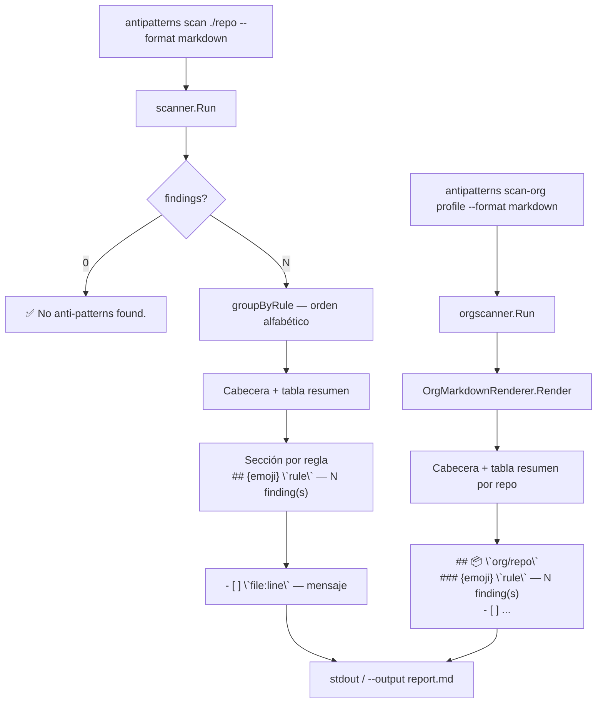

# 📄 Fase 8 — Renderer Markdown: Informes Accionables

## 🤔 ¿Qué hago? ¿Cómo lo hago? ¿Y para qué lo hago?

**¿Qué hago?**
Genero un informe en formato Markdown cuando se usa `--format markdown` (o `--format md`). El informe agrupa los antipatrones detectados por regla y convierte cada finding en un checkbox `- [ ]` Markdown.

**¿Cómo lo hago?**
Dos nuevos renderers en el paquete `internal/renderer`:
- `MarkdownRenderer` — para el comando `scan` (recibe `[]model.Finding`)
- `OrgMarkdownRenderer` — para el comando `scan-org` (recibe `*model.OrgReport`)

Ambos renderers se conectan en `cmd/antipatterns/main.go` bajo `case "markdown", "md":`. El informe se escribe a `stdout` por defecto; con `--output report.md` se vuelca a fichero.

**¿Para qué lo hago?**
Los formatos `console`, `json` y `sarif` cubren visualización terminal, pipelines y GitHub Code Scanning. Ninguno genera un artefacto persistible y accionable pensado para revisión humana. El formato Markdown resuelve el ciclo completo: **detectar → documentar → corregir** sin salir del editor.

---

## 📊 Diagrama de flujo



---

## 📝 Estructura del informe — `scan`

```markdown
# 🔍 Anti-pattern Report

> **Path:** `/path/to/repo`
> **Date:** 2026-07-24
> **Tool:** antipatterns v1.2.0

## 📊 Resumen

**Total: 28 finding(s)**

| Regla | Severidad | Findings |
| --- | --- | --- |
| `cyclomatic_complexity` | 🟡 medium | 3 |
| `duplication` | 🟡 medium | 10 |
| `large_function` | 🟡 medium | 15 |

---

## 🟡 `cyclomatic_complexity` — 3 finding(s)

- [ ] **`internal/scanner/scanner.go:73`** — function Run: cyclomatic complexity 18 (threshold 15)
- [ ] **`cmd/antipatterns/main.go:42`** — function scanCmd: cyclomatic complexity 16 (threshold 15)

## 🟡 `large_function` — 15 finding(s)

- [ ] **`internal/adapter/jscpd.go:35`** — function Jscpd has 72 lines (threshold 60)
```

---

## 🌐 Estructura del informe — `scan-org`

```markdown
# 🌐 Org Anti-pattern Report

> **Org:** `Ka0s-Klaus`
> **Date:** 2026-07-24
> **Tool:** antipatterns v1.2.0
> **Repos:** 3  |  **Total findings:** 42

## 📊 Resumen por repositorio

| Repo | Estado | Findings | Top rule |
| --- | --- | --- | --- |
| `Ka0s-Klaus/repo-a` | ⚠️ | 28 | `large_function` |
| `Ka0s-Klaus/repo-b` | ✅ | 0 | — |
| `Ka0s-Klaus/repo-c` | ❌ error | — | clone failed |

---

## 📦 `Ka0s-Klaus/repo-a`

### 🟡 `large_function` — 15 finding(s)

- [ ] **`cmd/main.go:42`** — function scanCmd has 87 lines (threshold 60)
```

---

## 🚀 Uso

### Generar informe en terminal

```bash
antipatterns scan ./mi-repo --format markdown
```

### Guardar en fichero

```bash
antipatterns scan ./mi-repo --format markdown --output report.md
```

### Con verbose — ver progreso y luego el informe

```bash
antipatterns scan ./mi-repo --format markdown --verbose --output report.md
```

### Alias `md`

```bash
antipatterns scan ./mi-repo --format md --output report.md
```

### Scan de org con informe Markdown

```bash
antipatterns scan-org my-profile --format markdown --output org-report.md
```

---

## 🏗️ Cambios técnicos

| Fichero | Tipo | Descripción |
| --- | --- | --- |
| `internal/renderer/markdown.go` | NUEVO | `MarkdownRenderer` para `scan` |
| `internal/renderer/org_markdown.go` | NUEVO | `OrgMarkdownRenderer` para `scan-org` |
| `internal/renderer/markdown_test.go` | NUEVO | 7 tests para `MarkdownRenderer` |
| `internal/renderer/org_markdown_test.go` | NUEVO | 6 tests para `OrgMarkdownRenderer` |
| `cmd/antipatterns/main.go` | MODIFICADO | `case "markdown", "md":` en `scan` y `scan-org` |

### Función compartida `groupByRule`

Definida en `markdown.go`, accesible desde `org_markdown.go` por pertenecer al mismo paquete. Agrupa `[]model.Finding` por `Rule` y devuelve el slice de reglas en orden alfabético.

```go
func groupByRule(findings []model.Finding) ([]string, map[string][]model.Finding)
```

### Emojis de severidad

| Severidad | Emoji |
| --- | --- |
| `info` | 🔵 |
| `low` | 🟢 |
| `medium` | 🟡 |
| `high` | 🟠 |
| `critical` | 🔴 |

---

## 🔗 Documentos relacionados

- [fase-7-verbose-oss-local.md](fase-7-verbose-oss-local.md) — Flag `--verbose` + separación stdout/stderr
- [fase-2-adaptadores-oss.md](fase-2-adaptadores-oss.md) — Adaptadores OSS y `ErrToolNotFound`
- [fase-5-publicacion.md](fase-5-publicacion.md) — Proceso de release con GoReleaser
- [fase-3-sarif-action.md](fase-3-sarif-action.md) — Renderer SARIF (formato para CI)
